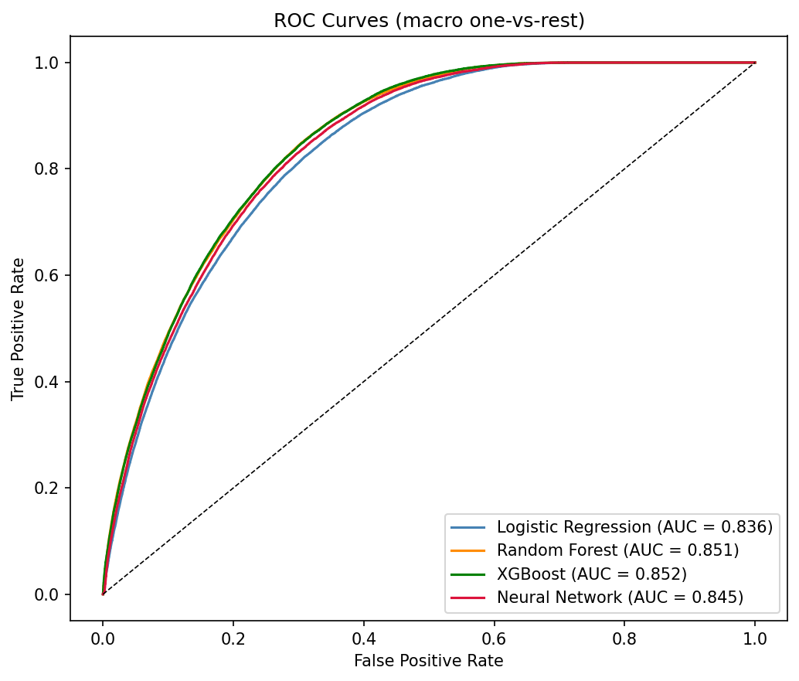
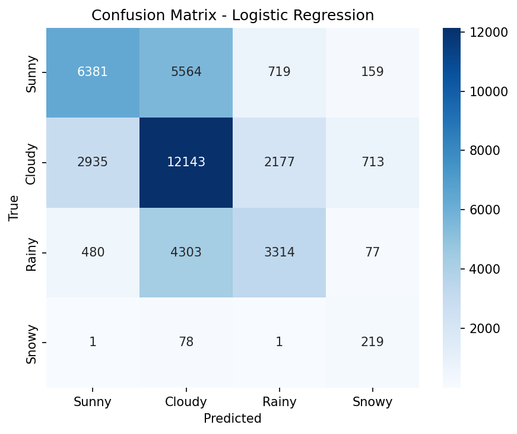
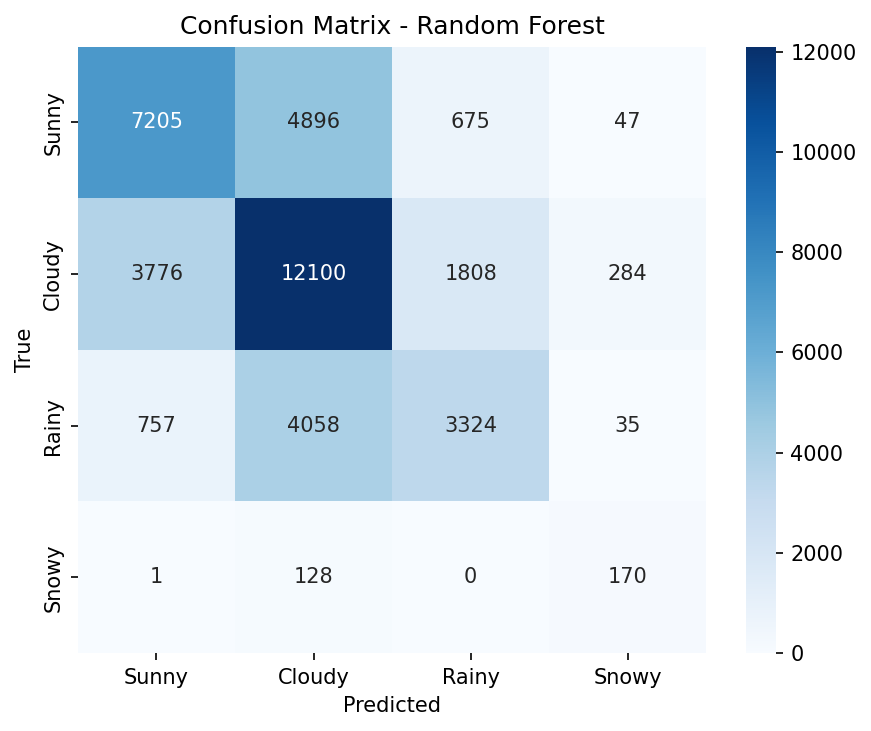
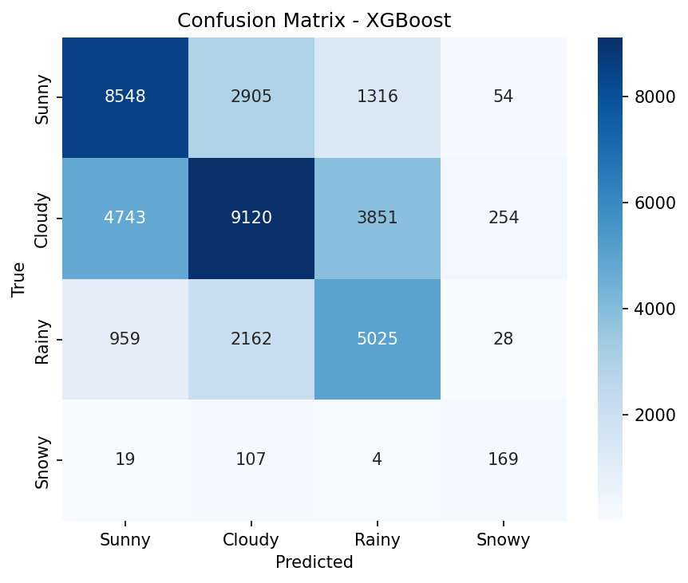
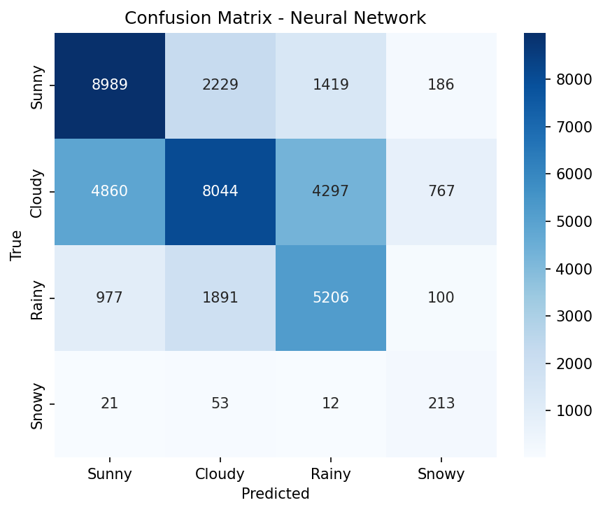
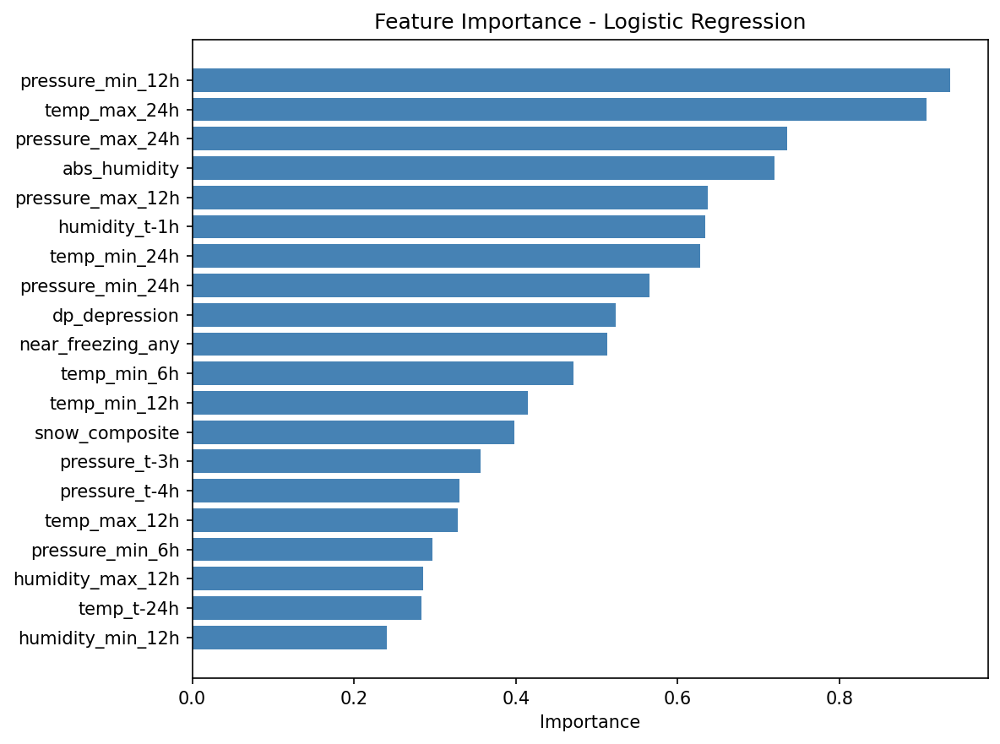
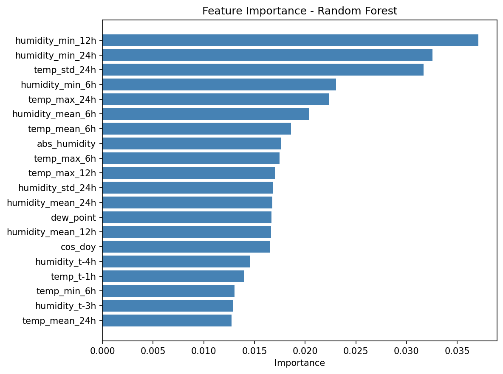
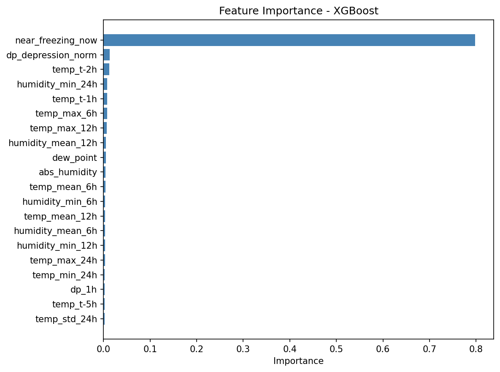
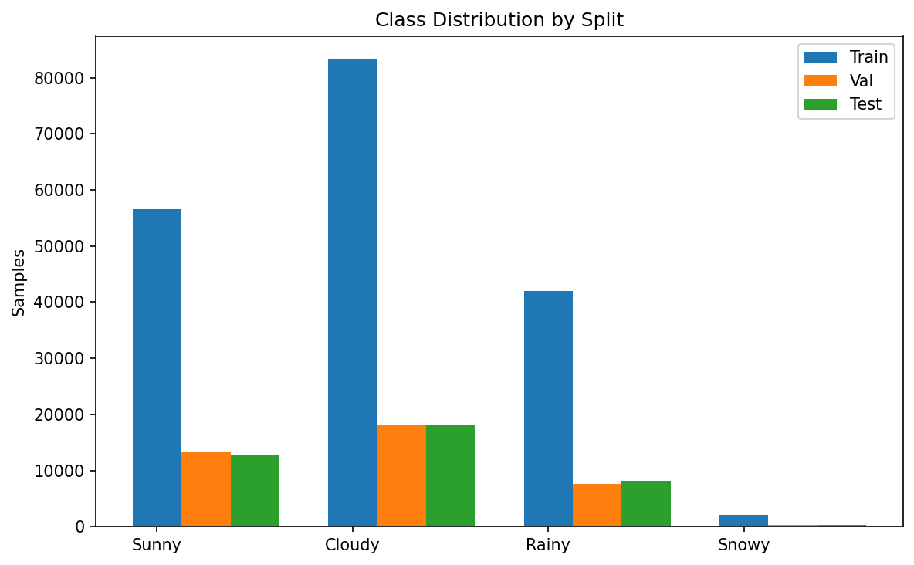

<p align="center">
  
</p>

<h1 align="center">AI Weather Prediction System</h1>

<p align="center">
  <strong>Edge-deployable 6-hour weather forecasting using ML models on ESP32-S3</strong>
</p>

<p align="center">
  <a href="#features">Features</a> •
  <a href="#architecture">Architecture</a> •
  <a href="#models">Models</a> •
  <a href="#quick-start">Quick Start</a> •
  <a href="#evaluation-results">Results</a> •
  <a href="#deployment">Deployment</a>
</p>

---

## Overview

**AI-Weather-Display-LilyGo** is an end-to-end machine learning pipeline that predicts weather conditions **6 hours ahead** using data from a **Bosch BME688** environmental sensor. The system compares four ML models — Logistic Regression, Random Forest, XGBoost, and Neural Network — and exports optimized deployment artifacts targeting the **LilyGo T-Display S3 (ESP32-S3)** microcontroller.

The pipeline trains offline in Python, evaluates all models on identical test data, generates a comparative HTML report, and produces lightweight C/C++ inference code that runs directly on the ESP32-S3 at 240 MHz — no cloud or internet required at inference time.

**Author:** Maj Prabhat

---

## Features

- **4-Class Weather Classification** — Sunny ☀️ / Cloudy ☁️ / Rainy 🌧️ / Snowy ❄️ (Stormy WMO codes merged into Rainy)
- **6-Hour Forecast Horizon** — Predicts conditions 6 hours ahead from the last 24 hours of sensor readings
- **4 Model Comparison** — Logistic Regression, Random Forest, XGBoost, and Neural Network trained and evaluated side-by-side
- **128-Feature Engineering Pipeline** — Shared feature extraction across all models (raw lags, pressure tendencies, dew point, rolling statistics, cyclical time encoding, and discriminative weather features)
- **Edge Deployment Ready** — Generates C headers, C inference code (via m2cgen), and TFLite models for microcontroller deployment
- **Automated HTML Report** — Jinja2-templated comparative report with confusion matrices, ROC curves, feature importance charts, and deployment recommendations
- **Open Data** — Trains on freely available [Open-Meteo](https://open-meteo.com/) historical weather data (no API key required)
- **SMOTE Class Balancing** — Handles class imbalance via synthetic oversampling
- **Full Test Suite** — Comprehensive pytest-based tests for every module

---

## Architecture

```
┌─────────────────────────────────────────────────────────────────────┐
│                        DATA PIPELINE                                │
│                                                                     │
│  Open-Meteo API ──► download.py ──► CSV Cache ──► Train/Val/Test   │
│  (6 stations,       (WMO code        (data/        (chronological   │
│   5 years)           mapping)         cache/)        70/15/15)      │
└────────────────────────────┬────────────────────────────────────────┘
                             │
                             ▼
┌─────────────────────────────────────────────────────────────────────┐
│                     FEATURE ENGINEERING                              │
│                                                                     │
│  engineering.py: 128 features from 24-hour sliding window           │
│  ┌──────────┬──────────────┬──────────┬──────────┬───────────────┐  │
│  │ Raw Lags │  Pressure &  │ Derived  │ Rolling  │Discriminative │  │
│  │   (72)   │  Temp Rates  │  (4)     │ Stats(36)│  Features(8)  │  │
│  │          │    (4+2)     │          │          │               │  │
│  └──────────┴──────────────┴──────────┴──────────┴───────────────┘  │
│                  + Cyclical Time Encoding (4)                       │
└────────────────────────────┬────────────────────────────────────────┘
                             │
                             ▼
┌─────────────────────────────────────────────────────────────────────┐
│                    MODEL TRAINING & EVALUATION                      │
│                                                                     │
│  ┌─────────────┐ ┌─────────────┐ ┌──────────┐ ┌────────────────┐  │
│  │  Logistic   │ │   Random    │ │ XGBoost  │ │    Neural      │  │
│  │ Regression  │ │   Forest    │ │          │ │    Network     │  │
│  │ (sklearn)   │ │ (sklearn)   │ │(xgboost) │ │ (TensorFlow)  │  │
│  └──────┬──────┘ └──────┬──────┘ └────┬─────┘ └───────┬────────┘  │
│         │               │              │               │           │
│         ▼               ▼              ▼               ▼           │
│     lr_coeff.h      rf_model.c    xgb_model.pkl   model.tflite    │
│      (~6 KB)       (via m2cgen)   (~22 MB)        (~91 KB)        │
└─────────────────────────────────────────────────────────────────────┘
                             │
                             ▼
┌─────────────────────────────────────────────────────────────────────┐
│               EDGE DEPLOYMENT (LilyGo T-Display S3)                │
│                                                                     │
│  BME688 Sensor ──► Feature Extraction ──► Scaled Input ──► Model   │
│  (T, RH, P)        (same 128 features)    (scaler_params.h)        │
│                     24-hour window                                 │
│                                                                     │
│  ESP32-S3 @ 240 MHz — Inference in microseconds, no cloud needed   │
└─────────────────────────────────────────────────────────────────────┘
```

---

## Sensor — Bosch BME688

The BME688 provides live environmental readings used at inference time on the edge device:

| Signal | Unit | Role |
|--------|------|------|
| Temperature | °C | Primary feature |
| Relative Humidity | % | Primary feature |
| Barometric Pressure | hPa | Primary feature (most predictive) |
| Gas Resistance | Ω | Optional — BME688 extra |
| IAQ Index | 0–500 | Optional — BME688 extra |
| eCO₂ | ppm equivalent | Optional — BME688 extra |
| Breath VOC | ppm | Optional — BME688 extra |

> **Note:** Only Temperature, Relative Humidity, and Barometric Pressure are used for both training and inference. Gas resistance, IAQ, eCO₂, and bVOC are **not used** in the current model (omitted to match publicly available training data).

---

## Dataset

**Source:** [Open-Meteo Historical Weather API](https://open-meteo.com/) — fully open-source, no API key required.

### Training Stations

Six geographically diverse stations ensure all four weather classes (Sunny, Cloudy, Rainy, Snowy) are well-represented:

| Station | Coordinates | Climate |
|---------|-------------|---------|
| London, UK | 51.5°N, 0.1°W | Temperate |
| Helsinki, Finland | 60.2°N, 25.0°E | Cold / Snowy |
| Singapore | 1.4°N, 103.8°E | Tropical / Stormy |
| Orlando, US | 28.5°N, 81.4°W | Subtropical / Thunderstorms |
| Dhaka, Bangladesh | 23.7°N, 90.4°E | Monsoon / Stormy |
| Manaus, Brazil | 3.1°S, 60.0°W | Equatorial / Heavy Rain |

### WMO Weather Code Mapping

| WMO Codes | Label |
|-----------|-------|
| 0, 1 | ☀️ **Sunny** |
| 2, 3, 45–48 | ☁️ **Cloudy** |
| 51–57, 61–67, 80–82, 95–99 | 🌧️ **Rainy** (Stormy codes merged in) |
| 71–77, 85–86 | ❄️ **Snowy** |

### Data Split

The split is **strictly chronological** (no shuffling) to prevent temporal data leakage:

| Split | Proportion | Purpose |
|-------|-----------|---------|
| Train | 70% | Model fitting |
| Validation | 15% | Hyperparameter tuning & early stopping |
| Test | 15% | Final evaluation (most recent data) |

**Volume:** ~5 years × 6 stations ≈ 260,000+ hourly samples.

---

## Feature Engineering

All models share an identical 128-feature extraction pipeline defined in `features/engineering.py`:

| Group | Description | Count |
|-------|-------------|-------|
| Raw Lags | Temperature, Humidity, Pressure × 24 timesteps | 72 |
| Pressure Tendency | ΔPressure at 1h, 12h, 24h intervals | 3 |
| Pressure Acceleration | ΔP_12h − ΔP_24h | 1 |
| Temperature Rate | ΔTemp at 1h and 12h intervals | 2 |
| Dew Point & Abs. Humidity | Magnus formula derived values | 2 |
| Rolling Statistics | mean, std, min, max × 6h, 12h & 24h × 3 signals | 36 |
| Cyclical Time | sin/cos of hour-of-day + day-of-year | 4 |
| Discriminative Features | Freeze flags, dew-point depression, pressure trend sign, snow/rain composites | 8 |
| **Total** | | **128** |

**Key design choices:**
- **Cyclical encoding** (sin/cos) ensures 23:00 and 00:00 are treated as adjacent, not distant
- **Pressure tendency & acceleration** are the most predictive features for short-horizon forecasting
- Rolling statistics use **6 h, 12 h, and 24 h** windows to capture multi-scale atmospheric trends
- **StandardScaler** is fit only on training data — parameters exported as C arrays for edge inference

---

## Models

### 1. Logistic Regression (Linear Baseline)

- Multinomial softmax via `saga` solver, L2 regularization, `max_iter=500`
- No class weighting (SMOTE used for balance instead)
- Deployment: coefficient matrix → `lr_coefficients.h` (C float array)
- Inference: matrix multiply + softmax — **~4.3 µs** on ESP32-S3

### 2. Random Forest Classifier

- 400 trees, max depth 12
- No class weighting (SMOTE used for balance instead)
- Deployment: converted to dependency-free C via `m2cgen` → `rf_model.c`
- Inference: decision tree traversal — **~40 µs** on ESP32-S3

### 3. XGBoost Classifier

- 600 estimators, max depth 8, learning rate 0.03
- Histogram-based tree method with L1/L2 regularisation
- Balanced class weights applied via sample_weight
- Deployment: serialized model file (~22 MB)
- Inference: **~40 µs** on ESP32-S3

### 4. Neural Network (TFLite)

- Architecture: `Input(128) → Dense(256, ReLU) → BatchNorm → Dropout(0.3) → Dense(128, ReLU) → BatchNorm → Dropout(0.25) → Dense(64, ReLU) → Dropout(0.2) → Dense(32, ReLU) → Dense(4, Softmax)`
- Early stopping on validation accuracy (patience=15), batch size 512, max 200 epochs
- Balanced class weights passed to fit()
- INT8 post-training quantization using 1000 stratified-random calibration samples
- Deployment: `.tflite` → `model_data.h` (C byte array, ~91 KB) — runs via TFLite Micro
- Inference: **~86 µs** on ESP32-S3

---

## Quick Start

### Prerequisites

- Python 3.10+
- pip

### Installation

```bash
cd prediction
pip install -r requirements.txt
```

### Run the Full Pipeline

```bash
# Download data → Train all models → Evaluate → Generate report
python main.py --report
```

### Run Individual Stages

```bash
# Stage 1: Download Open-Meteo data (cached after first run)
python main.py --only download

# Stage 2: Train all 4 models
python main.py --only train

# Stage 3: Evaluate on test set
python main.py --only evaluate

# Stage 4: Generate HTML comparison report
python main.py --only report
```

### Advanced Options

```bash
# Override default stations
python main.py --locations "London, UK" "Helsinki, Finland" "Singapore" --years 5 --report

# Force re-download even if cached data exists
python main.py --force-download --years 5

# Custom year range
python main.py --years 3 --report
```

### Run Tests

```bash
cd prediction
pytest
```

---

## Evaluation Results

All models evaluated on the same chronologically-held-out test set:

| Model | Accuracy | Macro F1 | Artifact Size | Inference Time (ESP32-S3) |
|-------|----------|----------|---------------|---------------------------|
| Logistic Regression | 56.2% | 0.482 | 6 KB | ~4.3 µs |
| Random Forest | 58.1% | 0.522 | 264,207 KB | ~40 µs |
| **XGBoost** | **58.2%** | **0.541** | 21,964 KB | ~40 µs |
| Neural Network | 57.2% | 0.500 | 91 KB | ~86 µs |

> **Note:** Models are trained on multi-station global data with 4 weather classes. SMOTE oversampling is applied to all minority classes (capped at 20% of majority class count). Balanced class weights are additionally applied to XGBoost and the Neural Network. The primary accuracy ceiling (~58–60%) is driven by the inherent ambiguity between Sunny and Cloudy conditions using only Temperature, Humidity, and Pressure signals.

### Per-Class F1 Scores

| Class | Logistic Reg | Random Forest | XGBoost | Neural Network |
|-------|-------------|---------------|---------|----------------|
| Sunny | 0.564 | 0.587 | 0.631 | 0.650 |
| Cloudy | 0.606 | 0.618 | 0.565 | 0.533 |
| Rainy | 0.461 | 0.476 | 0.547 | 0.545 |
| Snowy | 0.299 | 0.407 | 0.420 | 0.272 |

### Confusion Matrices

<p align="center">
  
  
</p>
<p align="center">
  
  
</p>

### Feature Importance

<p align="center">
  
  
</p>
<p align="center">
  
  
</p>

### ROC Curves

<p align="center">
  
</p>

### Class Distribution

<p align="center">
  
</p>

---

## Deployment

The pipeline generates self-contained deployment artifacts for the **LilyGo T-Display S3 (ESP32-S3)**:

| Artifact | Description | File |
|----------|-------------|------|
| `scaler_params.h` | StandardScaler mean/std as C arrays (shared by all models) | `deployment/scaler_params.h` |
| `lr_coefficients.h` | Logistic Regression weights as C floats | `deployment/lr_coefficients.h` |
| `rf_model.c` | Random Forest as dependency-free C code (m2cgen) | `deployment/rf_model.c` |
| `model_data.h` | Neural Network as INT8-quantized TFLite C byte array | `deployment/model_data.h` |
| `nn_model.keras` | Full Keras model (for re-export or fine-tuning) | `deployment/nn_model.keras` |
| `model.tflite` | TFLite binary (for testing outside ESP32) | `deployment/model.tflite` |

### Edge Inference Flow

```
BME688 Sensor Reading
        │
        ▼
┌───────────────────┐
│ Collect 24 hourly │
│ readings (ring     │
│ buffer on ESP32)   │
└────────┬──────────┘
         │
         ▼
┌───────────────────┐
│ Extract 128       │
│ features          │
│ (same pipeline    │
│  as training)     │
└────────┬──────────┘
         │
         ▼
┌───────────────────┐
│ Scale with        │
│ scaler_params.h   │
│ (mean/std)        │
└────────┬──────────┘
         │
         ▼
┌───────────────────┐
│ Run inference     │    Sunny / Cloudy / Rainy / Snowy
│ (LR / RF / XGB /  │──────────────────────────────────────────►
│  NN)              │
└───────────────────┘
```

---

## Project Structure

```
prediction/
├── main.py                     # CLI orchestrator — single entry point
├── requirements.txt            # Python dependencies
├── pytest.ini                  # Test configuration
│
├── data/
│   ├── download.py             # Open-Meteo fetch, WMO mapping, train/val/test split
│   ├── cache/                  # Raw CSV per station (cached indefinitely)
│   └── processed/              # train.csv, val.csv, test.csv
│
├── features/
│   ├── config.py               # RANDOM_SEED, LABEL_MAP, WMO_MAP, STATIONS, feature counts
    └── engineering.py          # 128-feature extraction (shared by all models)
│
├── models/
│   ├── logistic_regression.py  # LogisticRegressionModel class
│   ├── random_forest.py        # RandomForestModel class
│   ├── xgboost_model.py        # XGBoostModel class
│   └── neural_network.py       # NeuralNetworkModel class
│
├── evaluation/
│   ├── metrics.py              # compute_all_metrics(y_true, y_pred, y_proba)
│   ├── plots.py                # Confusion matrices, ROC curves, feature importance charts
│   └── outputs/                # results.json, .npy arrays, plot images
│
├── deployment/
│   ├── export.py               # TFLite conversion, C header generation, m2cgen export
│   ├── scaler_params.h         # StandardScaler mean/std as C arrays
│   ├── lr_coefficients.h       # LR model as C float arrays
│   ├── rf_model.c              # RF model as C inference code
│   ├── model_data.h            # TFLite model as C byte array
│   └── nn_model.keras          # Full Keras model
│
├── report/
│   ├── generate.py             # Jinja2-based HTML report generation
│   └── template.html           # Report template
│
├── reports/
│   └── report_output.html      # Generated comparative HTML report
│
├── tests/                      # Comprehensive pytest test suite
│   ├── conftest.py             # Shared fixtures
│   ├── test_config.py
│   ├── test_download.py
│   ├── test_engineering.py
│   ├── test_logistic_regression.py
│   ├── test_random_forest.py
│   ├── test_neural_network.py
│   ├── test_metrics.py
│   ├── test_plots.py
│   ├── test_export.py
│   └── test_integration.py
│
└── docs/
    ├── images/                 # Evaluation plots (confusion matrices, ROC, etc.)
    └── superpowers/
        ├── plans/              # Implementation plan
        └── specs/              # Design specification
```

---

## Tech Stack

| Component | Technology |
|-----------|-----------|
| Language | Python 3.10+ |
| ML Framework | scikit-learn, XGBoost, TensorFlow 2.x / Keras |
| Data Source | Open-Meteo API (`openmeteo-requests`) |
| Model Export | m2cgen (RF → C), TFLite (NN → INT8), custom (LR → C header) |
| Feature Scaling | scikit-learn StandardScaler |
| Class Balancing | SMOTE (imbalanced-learn) |
| Visualization | matplotlib, seaborn |
| Reporting | Jinja2 HTML templates |
| Testing | pytest, pytest-cov |
| Target Hardware | LilyGo T-Display S3 (ESP32-S3 @ 240 MHz) |
| Sensor | Bosch BME688 (Temperature, Humidity, Pressure, Gas, IAQ) |

---

## How It Works

1. **Data Download** — Fetches 5 years of hourly weather data from Open-Meteo for 6 globally diverse stations. WMO weather codes are mapped to 4 target classes. Data is cached locally.

2. **Chronological Split** — Data is split 70/15/15 into train/val/test sets strictly by time (no shuffling) to prevent temporal leakage.

3. **Feature Engineering** — A 24-hour sliding window produces 128 features per sample: raw sensor lags, pressure tendencies, derived meteorological quantities, rolling statistics, cyclical time encoding, and 8 discriminative weather features (freeze flags, dew-point depression, snow/rain composites).

4. **SMOTE Balancing** — Synthetic Minority Over-sampling Technique upsamples all minority classes (capped at 20% of majority count, max 5× expansion) in the training set only. Balanced class weights are additionally applied to XGBoost and the Neural Network.

5. **Model Training** — Four models train sequentially on the balanced dataset: Logistic Regression → Random Forest → XGBoost → Neural Network.

6. **Evaluation** — All models are evaluated on the held-out test set using accuracy, macro F1, per-class precision/recall, confusion matrices, and ROC-AUC.

7. **Artifact Export** — Deployment-ready C/C++ files are generated: coefficient headers, m2cgen C code, INT8-quantized TFLite models, and scaler parameters.

8. **Report Generation** — A comprehensive HTML report compares all models side-by-side with visualizations and a deployment recommendation.

---

## Configuration

Key constants in `features/config.py`:

| Constant | Value | Description |
|----------|-------|-------------|
| `RANDOM_SEED` | 42 | Global reproducibility seed |
| `LOOKBACK` | 24 | Hours of history used as input |
| `LOOKAHEAD` | 6 | Hours ahead to predict |
| `N_CLASSES` | 4 | Sunny, Cloudy, Rainy, Snowy |
| `TOTAL_FEATURE_COUNT` | 128 | Across 6 feature groups |

---

## License

This project is provided as-is for educational and research purposes.

---

<p align="center">
  Built with ❤️ by <strong>Maj Prabhat</strong>
</p>
